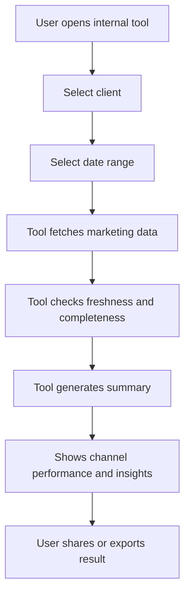

# System Flow Diagram

## User Interaction Flow

```
User opens MPA in browser
         |
         v
Selects a client brand from dropdown
         |
         v
Tool reads from central data store
(BigQuery — pre-populated by connectors)
         |
         v
Displays:
  ┌──────────────────────────────────────────────────────┐
  │  [Brand Name]        Last updated: Today 7:14am      │
  │                                                      │
  │  AUTO-SUMMARY                                        │
  │  "Paid social spend is up 18% this week but          │
  │   conversion rate has dropped. Email is below        │
  │   4-week average. Organic search stable."            │
  │                                                      │
  │  ─────────────────────────────────────────────────   │
  │  CHANNEL BREAKDOWN         [7 days ▼]                │
  │                                                      │
  │  Paid Social (Meta)                    ↑ 18% spend   │
  │  Impressions: 420,000                                │
  │  Clicks: 3,100                                       │
  │  Spend: £2,400                         ↓ 12% CVR     │
  │  Conversions: 84                                     │
  │                                                      │
  │  Paid Search (Google Ads)              → stable      │
  │  ...                                                 │
  │                                                      │
  │  Organic (GA4)                         → stable      │
  │  ...                                                 │
  │                                                      │
  │  Email (HubSpot)                       ↓ below avg   │
  │  ...                                                 │
  └──────────────────────────────────────────────────────┘
         |
         v
User copies summary or reads numbers
and closes the tool. Done.
```

---

## Data Pipeline Flow

```
                    [Runs every morning at 7am — scheduled job]

  ┌─────────────┐    ┌─────────────┐    ┌─────────────┐    ┌─────────────┐
  │  Meta Ads   │    │ Google Ads  │    │    GA4      │    │  HubSpot    │
  │  Connector  │    │  Connector  │    │  Connector  │    │  Connector  │
  └──────┬──────┘    └──────┬──────┘    └──────┬──────┘    └──────┬──────┘
         │                  │                  │                  │
         └──────────────────┴──────────────────┴──────────────────┘
                                       │
                                       v
                             [Transform & Validate]
                             - Flatten nested JSON
                             - Standardise field names
                             - Calculate deltas vs. prior period
                             - Log errors / flag failed connectors
                                       │
                                       v
                              [Central Data Store]
                                   BigQuery
                             (one table per channel,
                              one row per brand per day)
                                       │
                                       v
                               [MPA Web App]
                          Reads from BigQuery on load
                          Generates plain-language summary
                          Displays snapshot + deltas
                                       │
                                       v
                                  [User]
```

---

## What Happens When a Connector Fails

```
Connector runs → API returns error or times out
         |
         v
Error is logged with timestamp and error type
         |
         v
Previous day's data remains in BigQuery (untouched)
         |
         v
MPA shows channel with notice:
"Meta data unavailable — showing last update from [date]"
         |
         v
User is not blocked. Other channels still show correctly.
Alert sent to whoever owns the pipeline (email/Slack to internal ops).
```

This is the most important reliability decision in the whole design.
The tool degrades gracefully — it never fails silently.
```
# User Flow



## What the user gets
The user leaves with a consistent answer to:
- how marketing is performing,
- which channels are working,
- and where attention should go next.
