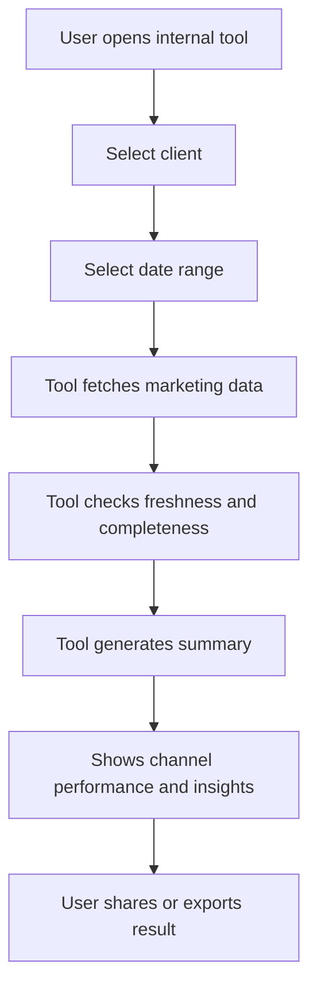

# User Flow

```mermaid
flowchart TD
    A[User opens internal tool] --> B[Select client]
    B --> C[Select date range]
    C --> D[Tool fetches marketing data]
    D --> E[Tool checks freshness and completeness]
    E --> F[Tool generates summary]
    F --> G[Shows channel performance and insights]
    G --> H[User shares or exports result]
```

## What the user gets
The user leaves with a consistent answer to:
- how marketing is performing,
- which channels are working,
- and where attention should go next.